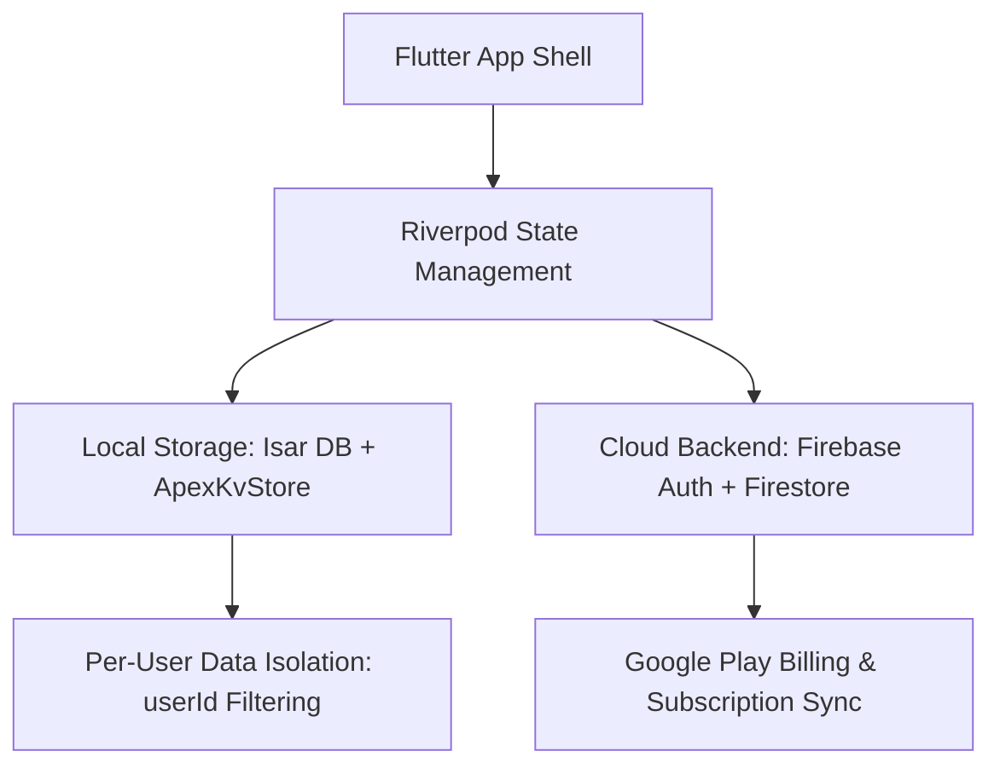

# Apex Flow 🏍️

> **Machine Relationship OS** — Motosiklet bakımı, sürüş ritüelleri ve makineyle duygusal bağı tek bir premium Flutter uygulamasında birleştiren global bir platform.

Ana hedef **Android / Google Play Store** çıkışıdır. Dahili test aşaması aktif olarak devam etmektedir.

---

## 📋 Proje Durumu — v1.0.0+19 (31 Temmuz 2026)

**Tüm Phase 1-7 Tamamlandı — Google Play Dahili Test Sürümü Aktif (Build 19)**

### ⚡ Öne Çıkan Çalışan Özellikler

| Modül | Açıklama | Durum |
|---|---|---|
| **Dashboard + Harmony Engine** | Canlı makine sağlık puanı, sezgisel bakım durumu ve sürüş önerileri | ✅ |
| **Garage** | Çoklu motosiklet yönetimi, servis kayıtları ve parça ömrü takibi | ✅ |
| **Machine Memory Timeline** | Motosikletinizin tüm sürüş, bakım ve anı geçmişi kronolojisi | ✅ |
| **Dijital Kaza Tutanağı** | Kaza anında hızlıca resmi tutanak hazırlama ve **hazır PDF çıktısı alma** | ✅ 🆕 |
| **Ride Readiness & Daily Check** | Güvenli sürüş öncesi 60 saniyelik makine kontrol listesi | ✅ |
| **Yenilenmiş Premium Paywall** | Aylık (₺14,99) & Yıllık (₺99,99 - ÖNERİLEN) yan yana eşit abonelik kartları | ✅ (Build 19) |
| **Kullanıcı Veri İzolasyonu** | Cihaz üzerindeki sürüşlerin ve verilerin kişiye özel `userId` ile ayrıştırılması | ✅ 🆕 |
| **Weather Intelligence** | Canlı hava durumu entegrasyonu ve sürüş uygunluk indeksi | ✅ |
| **Fuel Tracker & Fiş OCR** | Benzin harcamaları ve kamera ile yakıt fişi tarama | ✅ |
| **Insights & Harcama Analitiği** | Kategori bazlı harcama grafikleri ve toplam maliyet raporu | ✅ |
| **Ride-to-Maintenance Intelligence** | Sürüş tarzı ve km bazlı parça aşınma hesaplama algoritmaları | ✅ |
| **Garage Passport & PDF Araçları** | Paylaşılabilir PDF pasaport, Certified Ledger ve Park QR Çıkartması | ✅ |
| **Document Vault Pro** | Ruhsat, sigorta, muayene evrak deposu ve son kullanma bildirimleri | ✅ |
| **Digital SOS & Emergency Card** | Acil durum kan grubu, yakın bilgisi kartı ve kilit ekranı widget'ı | ✅ |
| **Rider ID Card & Flex Store** | 11 özel tema, renk gradyanları, rozetler ve destekçi seviyeleri | ✅ |
| **Konum Tabanlı Sürücü Radar** | 100 km çaptaki aktif sürücüleri tarama ve arkadaş ekleme | ✅ |
| **Çoklu Dil Desteği (I18n)** | %100 Türkçe, İngilizce ve Almanca dinamik çeviri desteği | ✅ |

---

## 🛠️ Teknik Mimari



- **Framework:** Flutter 3.x (Dart)
- **State Management:** Riverpod 2.x
- **Yerel Depolama:** Isar DB (Kullanıcı İzolasyonlu) + SharedPreferences
- **Backend Services:** Firebase Auth (Email Verification) + Cloud Firestore
- **Yerel Bildirimler:** `flutter_local_notifications`
- **Doküman & PDF:** `pdf` + `printing` paketleri
- **Konum & Harita:** `geolocator` + Google Maps API
- **Tasarım Sistemi:** Custom ApexTheme (Industrial Dark, 8pt Spacing, 4-6px Radius)

---

## 💳 Fiyatlandırma & Abonelik Modeli

| Plan | Türkiye (TRY) | ABD (USD) | Avrupa (EUR) | Özellikler |
|---|---|---|---|---|
| **Aylık Abonelik** | ₺14,99 / ay | $4.99 / mo | €4.99 / mo | Tüm Premium Modüller, Kaza Tutanağı PDF, Sınırsız Garaj |
| **Yıllık Abonelik (ÖNERİLEN)** | ₺99,99 / yıl | $29.99 / yr | €29.99 / yr | En Popüler Seçenek, Yıllık Faturalandırma |
| **Destekçi Paketleri** | Tier 1-3 | Tier 1-3 | Tier 1-3 | Özel Rider Card Temaları, Rozetler & Animasyonlu Efektler (Kozmetik) |

---

## 📖 Dokümantasyon & Kaynaklar

- 📌 [`docs/HANDOFF_FOR_AI.md`](docs/HANDOFF_FOR_AI.md) — Proje Özet Bağlamı
- 🎯 [`docs/MISSION_VISION.md`](docs/MISSION_VISION.md) — Ürün Felsefesi ve Vizyon
- 🚀 [`docs/ROADMAP_PHASES.md`](docs/ROADMAP_PHASES.md) — Faz Yol Haritası
- 🎨 [`docs/RIDER_CARD_SPECS.md`](docs/RIDER_CARD_SPECS.md) — Rider Card Tasarım Spesifikasyonları
- 📝 [`docs/DEVLOG.md`](docs/DEVLOG.md) — Geliştirme Günlüğü

---

## ⚡ Kalite & Test Komutları

Uygulamayı derlemeden veya yayınlamadan önce kod kalitesini doğrulamak için:

```bash
# Kod analizi ve stil denetimi
flutter analyze

# Birim ve entegrasyon testleri
flutter test
```

---

## 🎯 Güncel Milestone & Yayın Durumu

- [x] **Dahili Test (Internal Testing):** Google Play Console AAB yüklemesi (Build 19)
- [ ] **Kapalı Test (Closed Beta):** Davetli sürücü grubu ile saha testleri
- [ ] **Genel Yayın (Production Launch):** Google Play Store & Apple App Store Canlı Lansman
